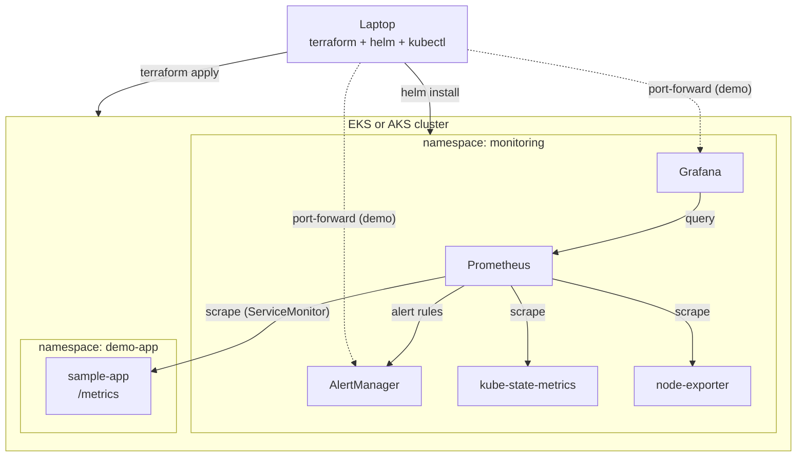

# Observability Stack (AWS EKS + Azure AKS)

A multi-cloud, deploy/demo/destroy observability platform. The same Helm-based
monitoring stack runs on both EKS and AKS, so the only real difference between
the clouds is the cluster provisioning. Everything is built to spin up, capture
proof for a portfolio writeup, and tear down so cost stays near zero.

> Status: both the AWS (EKS) and Azure (AKS) paths have been deployed and
> validated end to end (Prometheus scraping all targets up, alert rules loaded,
> Grafana live), then torn down clean with zero residual billing on each cloud.

## What gets deployed

Identical core on each cloud via the `kube-prometheus-stack` Helm chart:

- **Prometheus** for metrics scraping and storage
- **Grafana** with prebuilt Kubernetes dashboards
- **AlertManager** for routing alerts
- **node-exporter** and **kube-state-metrics** for node and cluster signals
- A small **sample workload** that exposes `/metrics` so the dashboards show
  real data
- Custom **alert rules** (target down, pod crashloop, high memory) wired to
  AlertManager

## Architecture

The same in-cluster stack runs on both clouds. Terraform provisions the cluster,
Helm installs `kube-prometheus-stack`, and Prometheus scrapes the node, cluster,
and sample-app targets. Grafana reads from Prometheus, and AlertManager routes
the alert rules.



## Layout

```
observability-stack/
├── aws/terraform/      # EKS cluster (VPC + EKS via official modules)
├── azure/terraform/    # AKS cluster (resource group + AKS)
├── helm/               # kube-prometheus-stack values + custom alert rules
├── workload/           # sample app that exposes Prometheus metrics
├── scripts/            # deploy / demo / destroy
└── docs/               # screenshots and writeup notes
```

## Prerequisites

- Terraform >= 1.5
- `kubectl` and `helm`
- AWS path: `aws` CLI authenticated
- Azure path: `az` CLI authenticated (`az login`)

## Usage

Each script takes the cloud as the first argument: `aws` or `azure`.

```bash
# Stand up a cluster and install the stack
./scripts/deploy.sh aws        # or: azure

# Port-forward Grafana, trip an alert, capture proof
./scripts/demo.sh aws          # or: azure

# Tear everything down
./scripts/destroy.sh aws       # or: azure
```

To show multi-cloud parity, run the full cycle on one cloud, then the other.

## Cost

The main cost is the managed control plane (~$0.10/hr for both EKS and AKS) plus
two small worker nodes. A single deploy/demo/destroy session runs to a couple of
dollars at most. Always run `destroy.sh` when you are done.

## Demo flow

`demo.sh` will:

1. Wait for the stack pods to become ready
2. Print the Grafana admin password and port-forward Grafana to `localhost:3000`
3. Delete the sample app's pods in a loop to trip the crashloop / target-down
   alert, so you can screenshot AlertManager firing
4. Leave port-forwards running until you Ctrl-C

Capture screenshots into `docs/` for the portfolio writeup.
